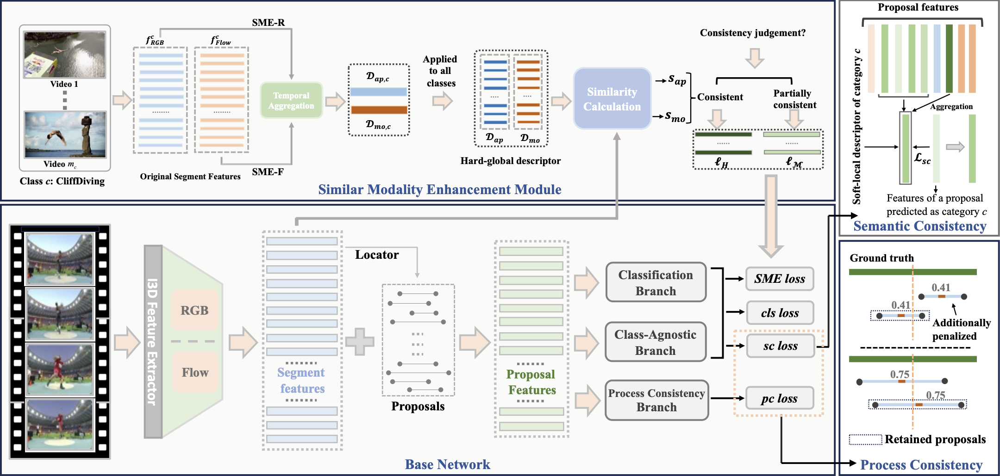

# Similar Modality Enhancement and Action Consistency Learning for Weakly Supervised Temporal Action Localization (AAAI 2025)

Maodong Li, Chao Zheng, Jian Wang, Bing Li (WHU)

[](https://openreview.net/forum?id=P1QZxs61Qz&referrer=%5BAuthor%20Console%5D(%2Fgroup%3Fid%3DAAAI.org%2F2025%2FConference%2FAuthors%23your-submissions))



## Abstract
Weakly-supervised temporal action localization (WTAL) aims to identify and localize action instances in untrimmed videos using only video-level labels. Existing methods typically rely on original features from frozen pre-trained encoders designed for trimmed action classification (TAC) tasks, which inevitably introduces task discrepancy. Additionally, these methods often overlook the importance of considering action consistency from multiple perspectives, specifically the consistency in action processes and action semantics, both of which are crucial for the model's understanding of actions. To address these issues, we propose a novel WTAL method based on similar modality enhancement and action consistency learning (SEAL). First, we construct global descriptors for each action category, and use the pseudo-labels generated based on these descriptors to guide the model in learning more consistent representations, thereby mitigating task discrepancy. Second, we design two types of losses to achieve action consistency learning: process consistency loss, which penalizes candidate proposals that deviate from the action center to ensure the completeness of the action process, and semantic consistency loss, which employs local descriptors to help proposals of the same action category (especially those with apparent semantic confusion) learn similar feature distributions. Extensive experiments on the THUMOS14 and ActivityNet datasets demonstrate the superior performance of the proposed method compared to state-of-the-art methods.

## Recommended Environment

* Python version: 3.8.0
* Pytorch version: 2.3.1
* CUDA version: 12.1
* Tensorboard version: 2.14.0

## Requirements
Here are the necessary dependencies:
* Numpy: 1.24.4
* Pandas: 2.0.3
* Tqdm: 4.66.4
* joblib: 1.4.2

## Data Preparation
1. Prepare [THUMOS14](https://www.crcv.ucf.edu/THUMOS14/) dataset.
    * To help you better reproduce our results, we recommend using the [pretrained I3D model](https://github.com/Finspire13/pytorch-i3d-feature-extraction.git) for feature extraction, as we did, or using the features provided by the classic methods [W-TALC](https://github.com/sujoyp/wtalc-pytorch) or [CO2-Net](https://github.com/harlanhong/MM2021-CO2-Net).
    * You can also get access of it from [Google Drive](https://drive.google.com/drive/folders/1_fGZpPM0PCTAgGQbQpBQEhK2KculypEu?usp=drive_link).

2. Prepare proposals.
    * We recommend using the official source code of the pretrained [LAC](https://github.com/Pilhyeon/Learning-Action-Completeness-from-Points) model to generate proposals.
    * It is worth noting that whether the proposals are generated by WTAL or P-WTAL, `only the timestamp information is utilized, so the difference lies solely in the proposal quality`. The experimental setting remains weakly supervised, using only video-level labels.
    * You can just download the proposals used in our paper from [Google Drive](https://drive.google.com/drive/folders/13iuiiz4xlbAmCMZCwH1xVxPs_meSHoCy?usp=drive_link).

3. Prepare descriptors.
   * The descriptors we designed are constructed based on Eq.(1) and Eq.(2) in the original paper, and you can directly follow these formulas to obtain the descriptors. Additionally, we have provided precomputed [video-level descriptors](https://drive.google.com/drive/folders/1rq6yXEADQMKprHHdXQuyfcuWBDj3X0mx?usp=drive_link) for the THUMOS14 dataset to facilitate quick experimentation.

4. Place the features and annotations inside a `data/Thumos14reduced/` folder,  proposals inside a `proposals` folder and descriptors inside a `descriptors` folder. Make sure the data structure is as below.

```
    ├── data
        └── Thumos14reduced
            ├── Thumos14reduced-I3D-JOINTFeatures.npy
            └── Thumos14reduced-Annotations
                ├── Ambiguous_test.txt
                ├── classlist.npy
                ├── duration.npy
                ├── extracted_fps.npy
                ├── labels_all.npy
                ├── labels.npy
                ├── original_fps.npy
                ├── segments.npy
                ├── subset.npy
                └── videoname.npy
    ├── proposals4Thumos14
        ├── Proposals_Thumos14reduced_train.json
        ├── Proposals_Thumos14reduced_test.json
    ├── descriptors
        └── Thumos14reduced
            ├── general_appearance_descriptors.npy
            ├── general_motion_descriptors.npy
```

## Quick Start

### Training

```bash
CUDA_VISIBLE_DEVICES=0 python main.py --run_type train
```

### Testing

Our pre-trained model `(AVG(0.1:0.7): 52.8)` can be downloaded from [Google Drive](https://drive.google.com/file/d/1B9K-cRtGeKvxWY458rweRNT_bQW2dz3T/view?usp=drive_link), which is then placed inside a `checkpoints` folder.

```bash
CUDA_VISIBLE_DEVICES=0 python main.py --run_type test --pretrained_ckpt checkpoints/best_model.pkl
```

## Results
Our experimental results on the THUMOS14 dataset are as follows. Please note that due to time constraints during submission, the result reported in the paper `(AVG(0.1:0.7): 52.8)` was not the best. Recently, `we have updated the best result to [AVG(0.1:0.7): 55.2]`, which suggests that a simple hyperparameter adjustment can lead to better performance.

| Method \ mAP@IoU (%)| @0.1 | @0.2 | @0.3 | @0.4 | @0.5 | @0.6 | @0.7 |0.1-0.7(AVG)|
|  :---:  |:----:|:----:|:----:|:----:|:----:|:----:|:----:|:----:|
| SEAL (Paper)   | 78.4 | 73.6 | 66.1 | 55.8 | 44.5 | 31.2 | 19.9 | 52.8 |
| SEAL (Latest, 2025/6/26)  | 80.0 | 75.7 | 67.4 | 58.1 | 48.9 | 35.6 | 20.8 | 55.2 |

## References & Citation
If you find this work helpful, please consider citing our paper, thank you!

```
@inproceedings{li2025similar,
  title={Similar Modality Enhancement and Action Consistency Learning for Weakly Supervised Temporal Action Localization},
  author={Li, Maodong and Zheng, Chao and Wang, Jian and Li, Bing},
  booktitle={Proceedings of the AAAI Conference on Artificial Intelligence},
  volume={39},
  number={5},
  pages={4842--4850},
  year={2025}
}
```

## Acknowledgement

We referred to the following repos when writing our code. We sincerely thank them for their outstanding contributions to the open-source community!

- [W-TALC](https://github.com/sujoyp/wtalc-pytorch)
- [CO2-Net](https://github.com/harlanhong/MM2021-CO2-Net)
- [P-MIL](https://github.com/RenHuan1999/CVPR2023_P-MIL)
